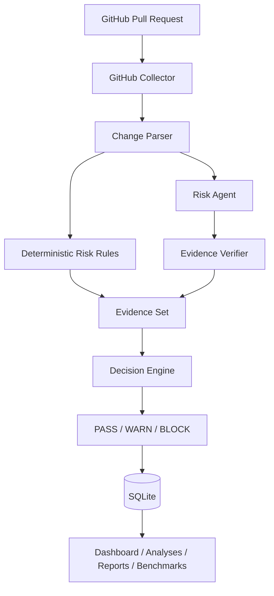

# Architecture

## Workflow

## Design principle

LLM output is advisory until verified. Risk Agent candidates must include a file path and an exact evidence quote. The verifier checks that quote against the collected patch before the claim is allowed into the supported evidence set.

## Deterministic layer

Current rules cover representative high-impact changes in:

- Kubernetes YAML;
- Terraform;
- Dockerfiles / Containerfiles;
- GitHub Actions workflows.

The deterministic layer is intentionally auditable and provides a stable fallback when no LLM is configured.

## Persistence

SQLite stores analyses, settings and benchmark runs. Secrets are excluded from public settings API responses, but production deployments should use a dedicated secret store.
